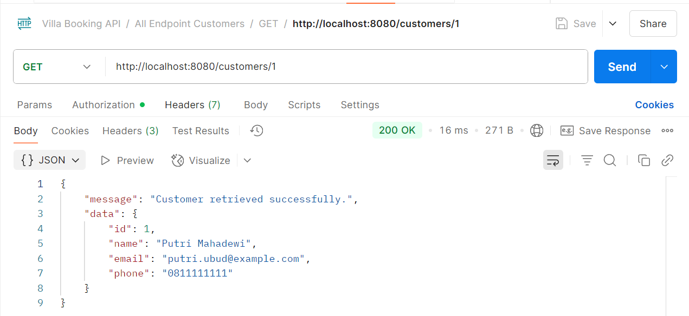

# **API JAVA OOP | SISTEM PEMESANAN VILA**  

**Mata Kuliah:** Pemrograman Berorientasi Objek B  
**Dosen Pengampu:** Wayan Oger Vihikan, S.T.I., M.I.T.  
**Semester:** 2/Genap

## **🌐 INTRODUCING** 
Tugas ini merupakan proyek pembuatan backend API sederhana sebagai pemenuhan tugas akhir mata kuliah Pemrograman Berorientasi Objek, menggunakan bahasa Java dengan pendekatan OOP. API dirancang untuk sistem pemesanan vila yang mencakup manajemen data vila, tipe kamar, pemesanan, ulasan pelanggan, dan voucher diskon. Komunikasi dilakukan melalui metode HTTP (GET, POST, PUT, DELETE) dengan format data JSON dan basis data SQLite. Pengujian dilakukan menggunakan Postman, serta akses dibatasi dengan API key yang di-hardcode.

## **🧑‍💻 MEMBER**
* **Anggota 1:** NI MADE ADELIA WIRASANTI - [2405551010] 
* **Anggota 2:** NI PUTU CANDRADEVI DAVANTARI - [2405551035]
* **Anggota 3:** KHARISMA ROSARY FITRI SANDA - [2405551072]
* **Anggota 4:** NI LUH PUTU INDAH SUARI - [2405551103]

## **🛠️ STRUCTURE**  
Struktur program proyek ini dibuat secara modular dengan prinsip OOP agar kode lebih rapi, mudah dipelihara, dan dikembangkan. Seluruh kode berada dalam folder src dan dibagi ke beberapa package sesuai fungsinya:
* **Package models →** Berisi class entitas utama seperti Booking, Customer, Review, Room, Villa, dan Voucher yang mencerminkan tabel pada database SQLite.
* **Package controllers →** Mengatur logika bisnis seperti validasi input, pemrosesan data, dan interaksi dengan database.
* **Package routes →** Menyediakan endpoint HTTP (GET, POST, PUT, DELETE) dan mengarahkan request ke controller.
* **Package queries →** Menyimpan query SQL untuk akses data, dipisahkan dari logika bisnis.
* **Package database →** Mengelola koneksi dan inisialisasi database SQLite.
* **Package exceptions →** Menangani error seperti data tidak ditemukan atau input tidak valid.
* **Package utils →** Menyediakan fungsi bantu seperti validasi email, parsing JSON, dan pengecekan tanggal.
* **Package core →** Menjalankan server HTTP, menyetel API key, dan memproses permintaan dari pengguna.

## **🔐 AUTENTIKASI**
Akses ke endpoint API dilakukan menggunakan autentikasi Bearer Token, yang berfungsi sebagai kunci akses untuk memastikan hanya pihak yang memiliki izin yang dapat mengakses dan memanipulasi data.

Gunakan header berikut pada setiap request:

<pre> Authorization: Bearer Token API1234 </pre> 

## **⚠️ ERROR HANDLING**
Program aplikasi ini dilengkapi sistem penanganan error menggunakan konsep Exception di Java. Jika terjadi kesalahan saat memproses request, server akan merespons dengan status HTTP dan pesan error dalam format JSON. Contohnya:
* 400 Bad Request jika data tidak lengkap atau format tidak valid (seperti email salah atau kapasitas bukan angka).
* 401 Unauthorized jika API key tidak disertakan atau tidak sesuai.
* 404 Not Found jika ID data tidak ditemukan.

## **⚙️ TEST IN POSTMAN**
Pengujian program dilakukan menggunakan Postman, dengan server API yang berjalan di localhost:8080. Meskipun dapat diakses melalui browser, Postman digunakan agar seluruh metode request seperti GET, POST, PUT, dan DELETE dapat diuji secara menyeluruh dan efisien.
## Villa Endpoints

### GET
- **`GET /villas`**   
   /villas](https://github.com/adeliawirasanti/Pembuatan-API-JAVA-OOP-Pemesanan-Vila/raw/main/images/villas.png)

- **`GET /villas/{id}`**  
  Informasi detail suatu vila  
 

- **`GET /villas/{id}/rooms`**  
  Informasi kamar suatu vila, lengkap dengan fasilitas dan harga  
  

- **`GET /villas/{id}/bookings`**  
  Daftar semua booking pada suatu vila  
  

- **`GET /villas/{id}/reviews`**  
  Daftar semua review pada suatu vila  

- **`GET /villas?ci_date={checkin_date}&co_date={checkout_date}`**  
  Pencarian ketersediaan vila berdasarkan tanggal check-in dan checkout  
  

### POST
- **`POST /villas`**  
  Menambahkan data vila  
 

- **`POST /villas/{id}/rooms`**  
  Menambahkan tipe kamar pada vila  
 

### PUT
- **`PUT /villas/{id}`**  
  Mengubah data suatu vila  
  

- **`PUT /villas/{id}/rooms/{id}`**  
  Mengubah informasi kamar suatu vila  
  

### DELETE
- **`DELETE /villas/{id}/rooms/{id}`**  
  Menghapus kamar suatu vila  
  

- **`DELETE /villas/{id}`**  
  Menghapus data suatu vila  
  

---

## Customers Endpoints

### GET
- **`GET /customers`**  
  Daftar semua customer  
  

- **`GET /customers/{id}`**  
  Informasi detail seorang customer  
  

- **`GET /customers/{id}/bookings`**  
  Daftar booking yang telah dilakukan  
  

- **`GET /customers/{id}/reviews`**  
  Daftar ulasan dari customer  
  

### POST
- **`POST /customers`**  
  Menambahkan customer baru  
  
)

- **`POST /customers/{id}/bookings`**  
  Customer melakukan pemesanan  
  

- **`POST /customers/{id}/bookings/{id}/reviews`**  
  Customer memberikan ulasan  
  

### PUT
- **`PUT /customers/{id}`**  
  Mengubah data customer  
  

---

## Vouchers Endpoints

### GET
- **`GET /vouchers`**  
  Daftar semua voucher  
  

- **`GET /vouchers/{id}`**  
  Detail informasi voucher  
  

### POST
- **`POST /vouchers`**  
  Menambahkan voucher baru  
  

### PUT
- **`PUT /vouchers/{id}`**  
  Mengubah data voucher  
  

### DELETE
- **`DELETE /vouchers/{id}`**  
  Menghapus voucher  
  

## ERROR 400

## ERROR 401

## ERROR 404
